# EraBrewer 

Palettes inspired by Taylor Swift’s album covers.

Structure of the package was based on
[`MetBrewer`](https://github.com/BlakeRMills/MetBrewer/) themselves
inspired by:

- [`RColorBrewer`](https://CRAN.R-project.org/package=RColorBrewer/RColorBrewer.pdf)
  from [Cynthia Brewer](https://colorbrewer2.org)
- [`PNWColors`](https://github.com/jakelawlor/PNWColors)
- [`wesanderson`](https://github.com/karthik/wesanderson)

[Installation](#install-package)

[Palettes](#palettes)

The colours are just colours. The copyright for the album covers is most
likely owned by either the publisher of the work or the artist(s) which
produced the recording or cover artwork in question. It is believed that
the use of low-resolution images of such covers qualifies as fair use.

## Install Package

### `R`

Install the released version from CRAN:

    install.packages("EraBrewer")

Or the development version from GitHub:

    # install.packages("pak")
    pak::pak("mathias-sm/EraBrewer")

Usage:

    ggplot(data=iris, aes(x=Sepal.Length, y=Sepal.Width, color=Species)) +
      geom_point() +
      scale_color_manual(values=era.brewer(palette_name, n=3))

### `Python`

Place `Python/era_brewer.py` into your source directory.

Use it in your code:

    from matplotlib.colors import LinearSegmentedColormap
    from cycler import cycler
    import era_brewer

    # Discrete
    color_scheme = era_brewer.era_brew('Lover1', n=5, brew_type="discrete")
    custom_cycler = cycler(color=color_scheme)

    # Continuous
    image_map = era_brewer.era_brew('Showgirl2',n=100,brew_type="continuous")
    custom_cmap = LinearSegmentedColormap.from_list("custom_gradient", image_map)

## Palettes

### Red1

<figure>
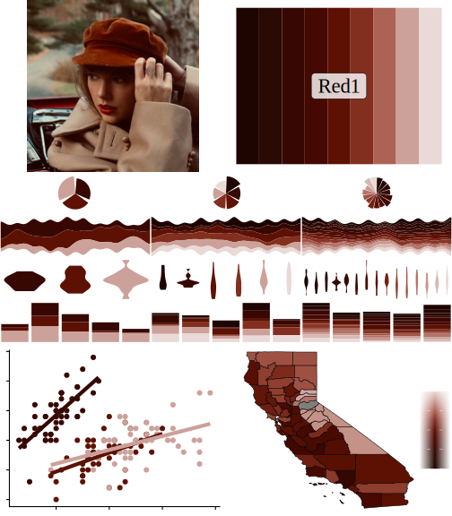
<figcaption aria-hidden="true">Cover and sample plots for the album
‘Red1’</figcaption>
</figure>

Colors:
`"#1E0502", "#2A0A04", "#370702", "#460902", "#5D1103", "#832F20", "#AC6356", "#CCA199", "#E9D9D7"`.

If you only need *n* colors, we suggest you use:

1.  `"#370702"`
2.  `"#370702", "#CCA199"`
3.  `"#370702", "#5D1103", "#CCA199"`
4.  `"#370702", "#5D1103", "#CCA199", "#E9D9D7"`
5.  `"#1E0502", "#370702", "#5D1103", "#CCA199", "#E9D9D7"`
6.  `"#1E0502", "#370702", "#5D1103", "#832F20", "#CCA199", "#E9D9D7"`
7.  `"#1E0502", "#2A0A04", "#370702", "#5D1103", "#832F20", "#CCA199", "#E9D9D7"`
8.  `"#1E0502", "#2A0A04", "#370702", "#5D1103", "#832F20", "#AC6356", "#CCA199", "#E9D9D7"`
9.  `"#1E0502", "#2A0A04", "#370702", "#460902", "#5D1103", "#832F20", "#AC6356", "#CCA199", "#E9D9D7"`

### Red2

<figure>
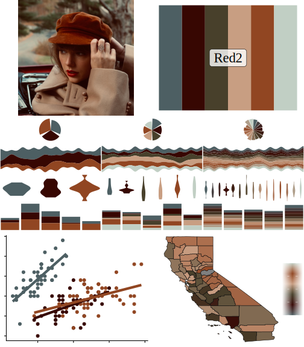
<figcaption aria-hidden="true">Cover and sample plots for the album
‘Red2’</figcaption>
</figure>

Colors:
`"#4D5F63", "#370702", "#48402B", "#C89E82", "#914622", "#C1CFC4"`.

If you only need *n* colors, we suggest you use:

1.  `"#4D5F63"`
2.  `"#4D5F63", "#914622"`
3.  `"#4D5F63", "#370702", "#914622"`
4.  `"#4D5F63", "#370702", "#914622", "#C1CFC4"`
5.  `"#4D5F63", "#370702", "#48402B", "#914622", "#C1CFC4"`
6.  `"#4D5F63", "#370702", "#48402B", "#C89E82", "#914622", "#C1CFC4"`

### NineteenEightyNine

<figure>
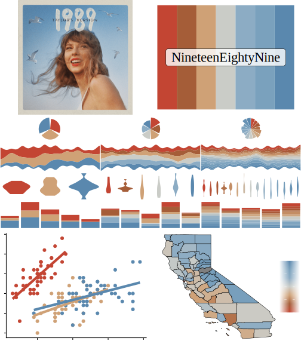
<figcaption aria-hidden="true">Cover and sample plots for the album
‘NineteenEightyNine’</figcaption>
</figure>

Colors:
`"#C34533", "#A55D38", "#CFA176", "#CACCC7", "#8CACC4", "#7AA1BD", "#5A88AE"`.

If you only need *n* colors, we suggest you use:

1.  `"#C34533"`
2.  `"#C34533", "#5A88AE"`
3.  `"#C34533", "#CFA176", "#5A88AE"`
4.  `"#C34533", "#CFA176", "#8CACC4", "#5A88AE"`
5.  `"#C34533", "#A55D38", "#CFA176", "#8CACC4", "#5A88AE"`
6.  `"#C34533", "#A55D38", "#CFA176", "#CACCC7", "#8CACC4", "#5A88AE"`
7.  `"#C34533", "#A55D38", "#CFA176", "#CACCC7", "#8CACC4", "#7AA1BD", "#5A88AE"`

### Showgirl1

<figure>
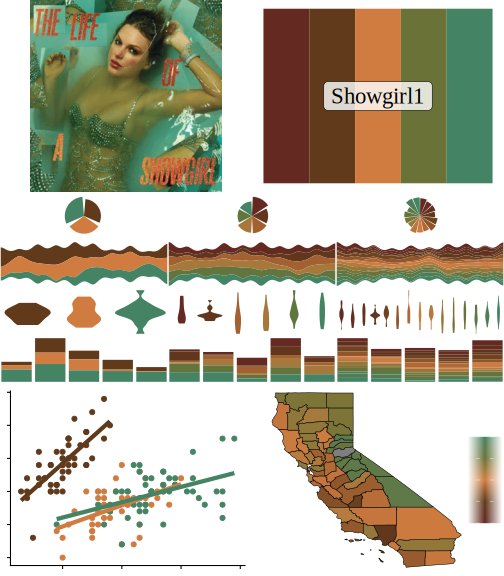
<figcaption aria-hidden="true">Cover and sample plots for the album
‘Showgirl1’</figcaption>
</figure>

Colors: `"#642921", "#613A1B", "#D07C40", "#6B7237", "#448363"`.

If you only need *n* colors, we suggest you use:

1.  `"#613A1B"`
2.  `"#613A1B", "#448363"`
3.  `"#613A1B", "#D07C40", "#448363"`
4.  `"#613A1B", "#D07C40", "#6B7237", "#448363"`
5.  `"#642921", "#613A1B", "#D07C40", "#6B7237", "#448363"`

### Showgirl2

<figure>
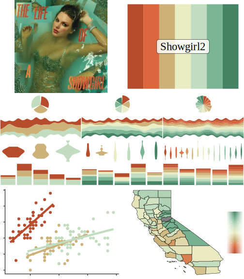
<figcaption aria-hidden="true">Cover and sample plots for the album
‘Showgirl2’</figcaption>
</figure>

Colors:
`"#B74C2D", "#DC673E", "#CCB178", "#EAEDC4", "#C1DCBF", "#7BB594", "#448363"`.

If you only need *n* colors, we suggest you use:

1.  `"#B74C2D"`
2.  `"#B74C2D", "#C1DCBF"`
3.  `"#B74C2D", "#CCB178", "#C1DCBF"`
4.  `"#B74C2D", "#CCB178", "#C1DCBF"`
5.  `"#B74C2D", "#CCB178", "#EAEDC4", "#C1DCBF", "#448363"`
6.  `"#B74C2D", "#CCB178", "#EAEDC4", "#C1DCBF", "#7BB594", "#448363"`
7.  `"#B74C2D", "#DC673E", "#CCB178", "#EAEDC4", "#C1DCBF", "#7BB594", "#448363"`

### SpeakNow1

<figure>
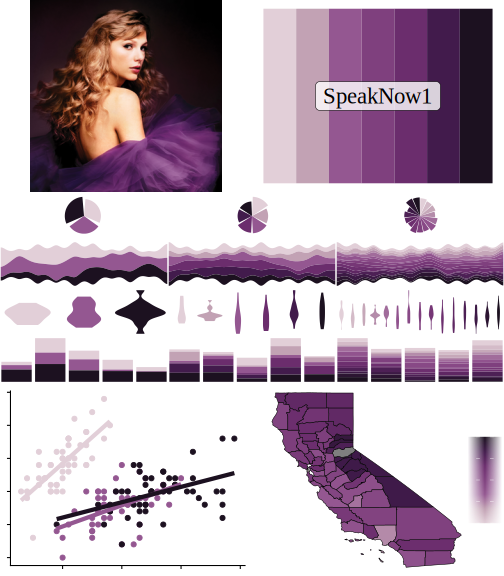
<figcaption aria-hidden="true">Cover and sample plots for the album
‘SpeakNow1’</figcaption>
</figure>

Colors:
`"#E2CFD8", "#C2A2B4", "#945791", "#7F407E", "#6B2D6D", "#421B4C", "#1C1120"`.

If you only need *n* colors, we suggest you use:

1.  `"#945791"`
2.  `"#E2CFD8", "#945791"`
3.  `"#E2CFD8", "#945791", "#1C1120"`
4.  `"#E2CFD8", "#945791", "#6B2D6D", "#1C1120"`
5.  `"#E2CFD8", "#945791", "#6B2D6D", "#421B4C", "#1C1120"`
6.  `"#E2CFD8", "#C2A2B4", "#945791", "#6B2D6D", "#421B4C", "#1C1120"`
7.  `"#E2CFD8", "#C2A2B4", "#945791", "#7F407E", "#6B2D6D", "#421B4C", "#1C1120"`

### SpeakNow2

<figure>
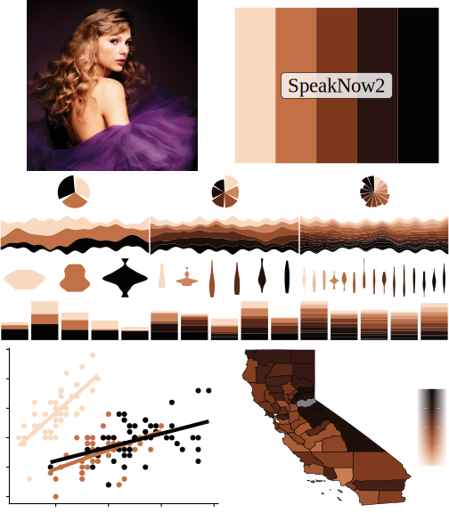
<figcaption aria-hidden="true">Cover and sample plots for the album
‘SpeakNow2’</figcaption>
</figure>

Colors: `"#F9DAC1", "#C27045", "#7E391D", "#29130F", "#050303"`.

If you only need *n* colors, we suggest you use:

1.  `"#C27045"`
2.  `"#C27045", "#050303"`
3.  `"#F9DAC1", "#C27045", "#050303"`
4.  `"#F9DAC1", "#C27045", "#7E391D", "#050303"`
5.  `"#F9DAC1", "#C27045", "#7E391D", "#29130F", "#050303"`

### TorturedPoet

<figure>

<figcaption aria-hidden="true">Cover and sample plots for the album
‘TorturedPoet’</figcaption>
</figure>

Colors:
`"#EDECE8", "#E1DED7", "#B7B0A6", "#7F776D", "#443D35", "#342D26", "#2C251F"`.

If you only need *n* colors, we suggest you use:

1.  `"#7F776D"`
2.  `"#7F776D", "#2C251F"`
3.  `"#EDECE8", "#7F776D", "#2C251F"`
4.  `"#EDECE8", "#B7B0A6", "#7F776D", "#2C251F"`
5.  `"#EDECE8", "#B7B0A6", "#7F776D", "#443D35", "#2C251F"`
6.  `"#EDECE8", "#E1DED7", "#B7B0A6", "#7F776D", "#443D35", "#2C251F"`
7.  `"#EDECE8", "#E1DED7", "#B7B0A6", "#7F776D", "#443D35", "#342D26", "#2C251F"`

### Fearless

<figure>
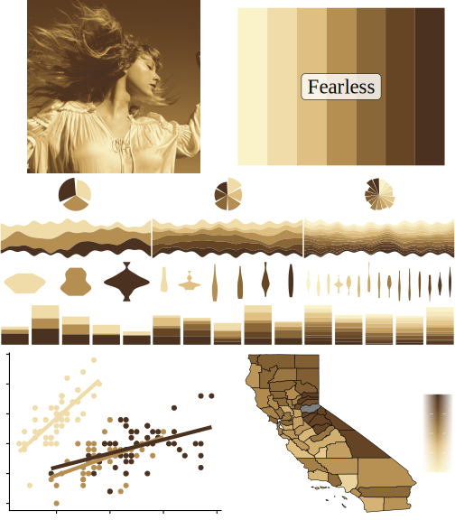
<figcaption aria-hidden="true">Cover and sample plots for the album
‘Fearless’</figcaption>
</figure>

Colors:
`"#FAF2C8", "#EFDCA8", "#E0C082", "#B58F51", "#8A6737", "#664525", "#4B3220"`.

If you only need *n* colors, we suggest you use:

1.  `"#B58F51"`
2.  `"#B58F51", "#4B3220"`
3.  `"#EFDCA8", "#B58F51", "#4B3220"`
4.  `"#EFDCA8", "#B58F51", "#664525", "#4B3220"`
5.  `"#EFDCA8", "#E0C082", "#B58F51", "#664525", "#4B3220"`
6.  `"#EFDCA8", "#E0C082", "#B58F51", "#8A6737", "#664525", "#4B3220"`
7.  `"#FAF2C8", "#EFDCA8", "#E0C082", "#B58F51", "#8A6737", "#664525", "#4B3220"`

### Evermore1

<figure>
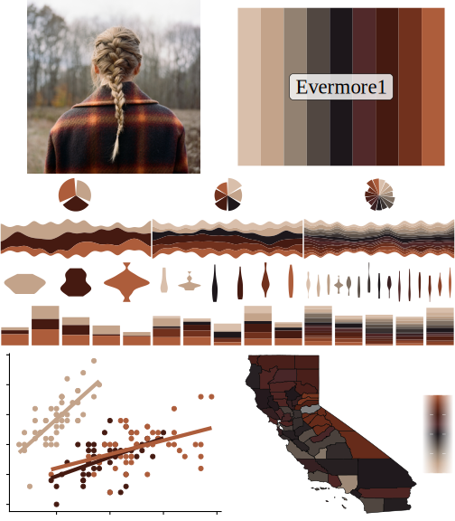
<figcaption aria-hidden="true">Cover and sample plots for the album
‘Evermore1’</figcaption>
</figure>

Colors:
`"#D9BFAB", "#C3A38A", "#928171", "#514741", "#1D171B", "#51292A", "#451A11", "#71311D", "#AD5D3B"`.

If you only need *n* colors, we suggest you use:

1.  `"#451A11"`
2.  `"#C3A38A", "#451A11"`
3.  `"#C3A38A", "#451A11", "#AD5D3B"`
4.  `"#C3A38A", "#1D171B", "#451A11", "#AD5D3B"`
5.  `"#D9BFAB", "#C3A38A", "#1D171B", "#451A11", "#AD5D3B"`
6.  `"#D9BFAB", "#C3A38A", "#1D171B", "#451A11", "#71311D", "#AD5D3B"`
7.  `"#D9BFAB", "#C3A38A", "#514741", "#1D171B", "#451A11", "#71311D", "#AD5D3B"`
8.  `"#D9BFAB", "#C3A38A", "#514741", "#1D171B", "#51292A", "#451A11", "#71311D", "#AD5D3B"`
9.  `"#D9BFAB", "#C3A38A", "#928171", "#514741", "#1D171B", "#51292A", "#451A11", "#71311D", "#AD5D3B"`

### Evermore2

<figure>
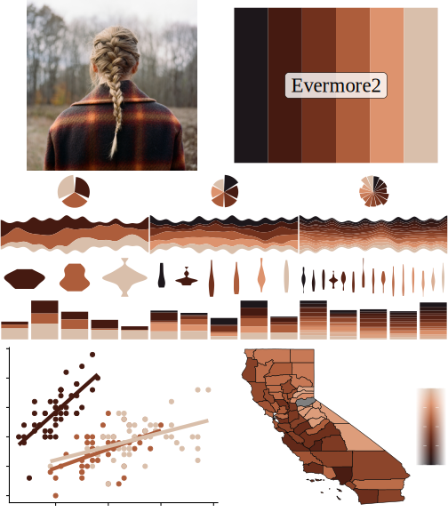
<figcaption aria-hidden="true">Cover and sample plots for the album
‘Evermore2’</figcaption>
</figure>

Colors:
`"#1D171B", "#451A11", "#71311D", "#AD5D3B", "#DD936E", "#D9BFAB"`.

If you only need *n* colors, we suggest you use:

1.  `"#AD5D3B"`
2.  `"#AD5D3B", "#D9BFAB"`
3.  `"#451A11", "#AD5D3B", "#D9BFAB"`
4.  `"#1D171B", "#451A11", "#AD5D3B", "#D9BFAB"`
5.  `"#1D171B", "#451A11", "#AD5D3B", "#DD936E", "#D9BFAB"`
6.  `"#1D171B", "#451A11", "#71311D", "#AD5D3B", "#DD936E", "#D9BFAB"`

### Reputation

<figure>
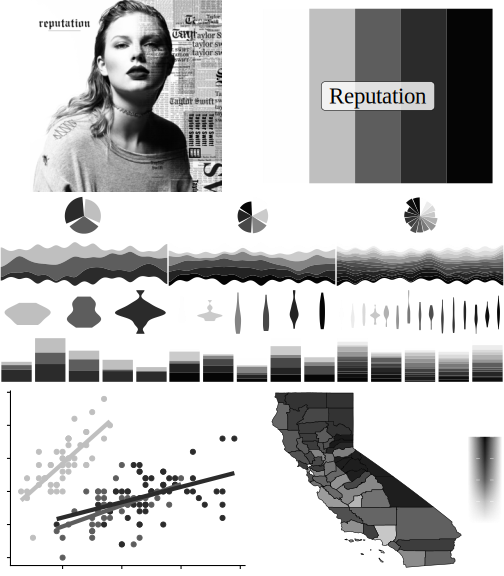
<figcaption aria-hidden="true">Cover and sample plots for the album
‘Reputation’</figcaption>
</figure>

Colors: `"#FEFEFE", "#BFBFBF", "#5D5D5D", "#2B2B2B", "#050505"`.

If you only need *n* colors, we suggest you use:

1.  `"#5D5D5D"`
2.  `"#5D5D5D", "#2B2B2B"`
3.  `"#BFBFBF", "#5D5D5D", "#2B2B2B"`
4.  `"#BFBFBF", "#5D5D5D", "#2B2B2B", "#050505"`
5.  `"#FEFEFE", "#BFBFBF", "#5D5D5D", "#2B2B2B", "#050505"`

### Lover1

<figure>
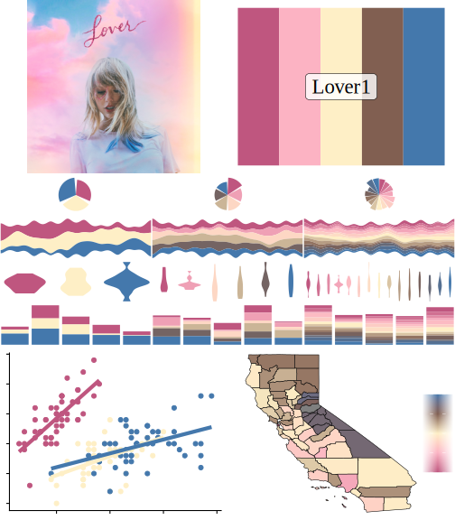
<figcaption aria-hidden="true">Cover and sample plots for the album
‘Lover1’</figcaption>
</figure>

Colors: `"#BF567F", "#FCB3C3", "#FEEFC6", "#815F51", "#4478AC"`.

If you only need *n* colors, we suggest you use:

1.  `"#BF567F"`
2.  `"#BF567F", "#4478AC"`
3.  `"#BF567F", "#FEEFC6", "#4478AC"`
4.  `"#BF567F", "#FEEFC6", "#815F51", "#4478AC"`
5.  `"#BF567F", "#FCB3C3", "#FEEFC6", "#815F51", "#4478AC"`

### Lover2

<figure>
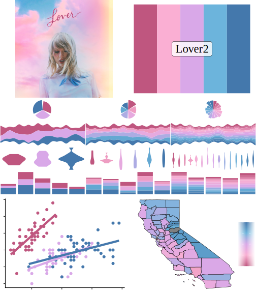
<figcaption aria-hidden="true">Cover and sample plots for the album
‘Lover2’</figcaption>
</figure>

Colors: `"#BF567F", "#FAAFD3", "#D9A8E8", "#6CB4DC", "#4478AC"`.

If you only need *n* colors, we suggest you use:

1.  `"#BF567F"`
2.  `"#BF567F", "#4478AC"`
3.  `"#BF567F", "#D9A8E8", "#4478AC"`
4.  `"#BF567F", "#D9A8E8", "#6CB4DC", "#4478AC"`
5.  `"#BF567F", "#FAAFD3", "#D9A8E8", "#6CB4DC", "#4478AC"`

### TaylorSwift

<figure>
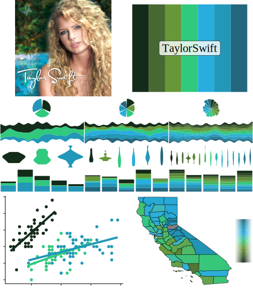
<figcaption aria-hidden="true">Cover and sample plots for the album
‘TaylorSwift’</figcaption>
</figure>

Colors:
`"#142B1A", "#486833", "#689739", "#30C97E", "#29ADDE", "#2297B8", "#23677E"`.

If you only need *n* colors, we suggest you use:

1.  `"#30C97E"`
2.  `"#30C97E", "#2297B8"`
3.  `"#142B1A", "#30C97E", "#2297B8"`
4.  `"#142B1A", "#30C97E", "#29ADDE", "#2297B8"`
5.  `"#142B1A", "#689739", "#30C97E", "#29ADDE", "#2297B8"`
6.  `"#142B1A", "#689739", "#30C97E", "#29ADDE", "#2297B8", "#23677E"`
7.  `"#142B1A", "#486833", "#689739", "#30C97E", "#29ADDE", "#2297B8", "#23677E"`

### Midnight1

<figure>
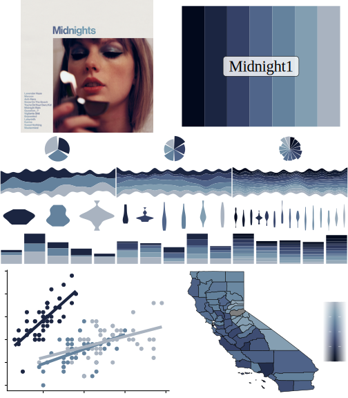
<figcaption aria-hidden="true">Cover and sample plots for the album
‘Midnight1’</figcaption>
</figure>

Colors:
`"#02091C", "#1B2541", "#354167", "#50658A", "#64829D", "#829EB1", "#A9B3C0"`.

If you only need *n* colors, we suggest you use:

1.  `"#64829D"`
2.  `"#1B2541", "#64829D"`
3.  `"#1B2541", "#64829D", "#A9B3C0"`
4.  `"#1B2541", "#50658A", "#64829D", "#A9B3C0"`
5.  `"#1B2541", "#50658A", "#64829D", "#829EB1", "#A9B3C0"`
6.  `"#1B2541", "#354167", "#50658A", "#64829D", "#829EB1", "#A9B3C0"`
7.  `"#02091C", "#1B2541", "#354167", "#50658A", "#64829D", "#829EB1", "#A9B3C0"`

### Midnight2

<figure>
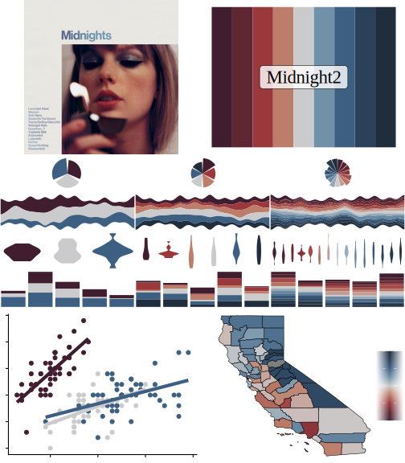
<figcaption aria-hidden="true">Cover and sample plots for the album
‘Midnight2’</figcaption>
</figure>

Colors:
`"#411D30", "#5F2732", "#9A383C", "#BC7E6A", "#CBCBCD", "#7191A9", "#3D5F82", "#2B4159", "#202D3C"`.

If you only need *n* colors, we suggest you use:

1.  `"#CBCBCD"`
2.  `"#411D30", "#CBCBCD"`
3.  `"#411D30", "#CBCBCD", "#3D5F82"`
4.  `"#411D30", "#9A383C", "#CBCBCD", "#3D5F82"`
5.  `"#411D30", "#9A383C", "#CBCBCD", "#3D5F82", "#202D3C"`
6.  `"#411D30", "#9A383C", "#BC7E6A", "#CBCBCD", "#3D5F82", "#202D3C"`
7.  `"#411D30", "#9A383C", "#BC7E6A", "#CBCBCD", "#3D5F82", "#2B4159", "#202D3C"`
8.  `"#411D30", "#5F2732", "#9A383C", "#BC7E6A", "#CBCBCD", "#3D5F82", "#2B4159", "#202D3C"`
9.  `"#411D30", "#5F2732", "#9A383C", "#BC7E6A", "#CBCBCD", "#7191A9", "#3D5F82", "#2B4159", "#202D3C"`

